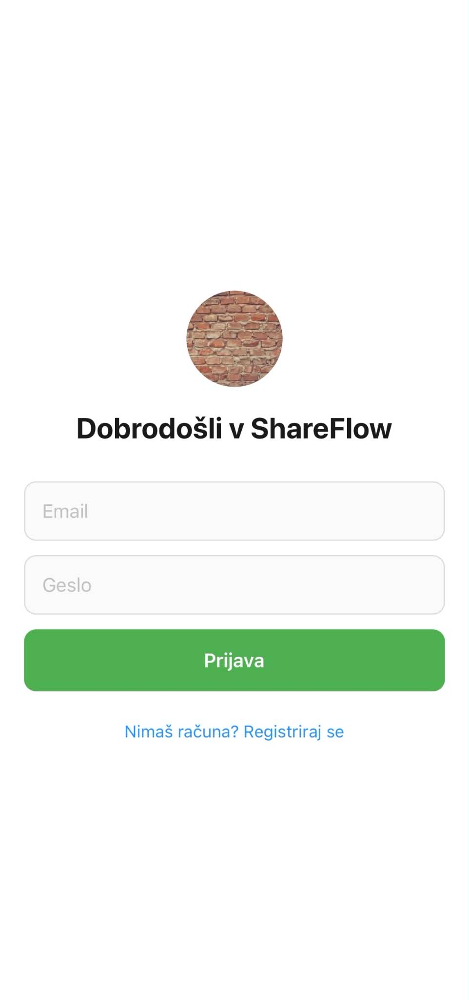
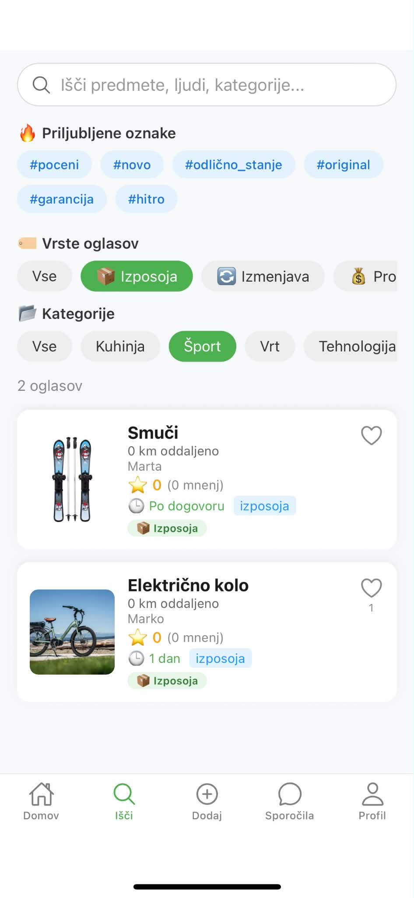
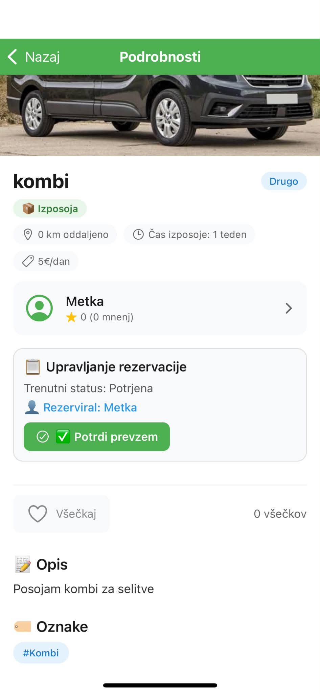
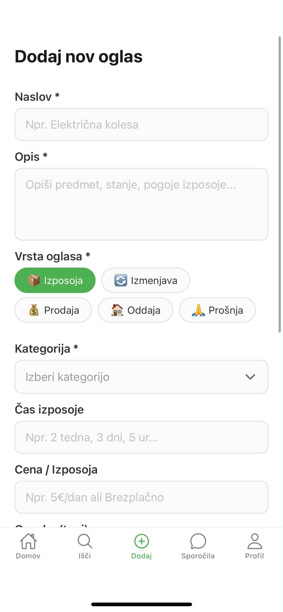
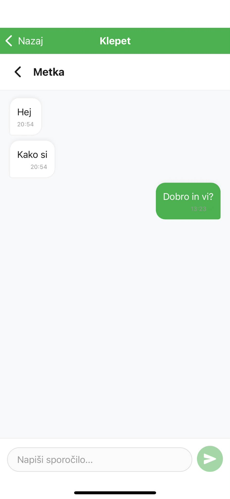

# 📱 ShareFlow

ShareFlow je mobilna aplikacija, razvita z uporabo **React Native** in **Expo**, ki uporabnikom omogoča **izposojo, prodajo, nakup, menjavo in podarjanje predmetov**. Namen aplikacije je spodbujati ponovno uporabo stvari, zmanjševati odpadke ter povezovati ljudi v lokalni skupnosti.

---

## 🎯 Ključne funkcionalnosti

### 📦 Upravljanje oglasov

* Dodajanje, urejanje in brisanje oglasov
* Podpora za **5 vrst oglasov**:

  * Izposoja
  * Izmenjava
  * Prodaja
  * Oddaja
  * Prošnja
* Dodajanje oznak (tagov) in kategorij za lažje iskanje
* Arhiviranje oglasov

### 📅 Rezervacije

* Izbira datuma in trajanja izposoje
* Statusi rezervacij:

  * Potrjena
  * Aktivna
  * Končana

* Odštevanje časa do zaključka izposoje

### 💬 Klepet v realnem času

* Sinhronizacija sporočil v realnem času z uporabo Firebase `onSnapshot`


### ⭐ Ocenjevanje

* Ocenjevanje uporabnikov (1–5 zvezdic)
* Pisanje mnenj
* Samodejni izračun povprečne ocene
* Ocenjevanje predmetov

### 🏆 XP sistem

* +10 XP za vsak objavljen oglas
* Napredovanje skozi levele (vsakih 100 XP)
* Vizualni prikaz napredka z XP Progress Bar

### ❤️ Všečki

* Shranjevanje priljubljenih oglasov
* Prikaz števila všečkov

### 🔍 Iskanje

* Iskanje po:

  * naslovu
  * opisu
  * kategoriji
  * lastniku
  * tagih
* Filtriranje po kategorijah
* Filtriranje po vrstah oglasov
* Hitro iskanje s priljubljenimi tagi

---

## 🛠️ Uporabljene tehnologije

* React Native
* Expo
* TypeScript
* Firebase Authentication
* Cloud Firestore
* Firebase Storage
* Expo Router

---

## 🚀 Namestitev projekta

### Predpogoji

* Node.js 16 ali novejši
* npm ali Yarn
* Expo CLI
* Android Studio ali Expo Go

### 1. Kloniranje repozitorija

```bash
git clone https://github.com/Sarar-design/ShareFlow.git
cd ShareFlow
```

### 2. Namestitev odvisnosti

```bash
npm install
```

### 3. Firebase

Projekt je že povezan z demo Firebase projektom, zato dodatna nastavitev ni potrebna.

Če želiš uporabiti svoj Firebase projekt, zamenjaj konfiguracijo v:

src/config/firebase.ts


### 4. Firestore Security Rules

javascript
rules_version = '2';

service cloud.firestore {
  match /databases/{database}/documents {
    match /{document=**} {
      allow read, write: if request.auth != null;
    }
  }
}

### 5. Zagon aplikacije

```bash
npx expo start
```

Aplikacijo lahko zaženete na:

* Android Emulatorju
* iOS Simulatorju
* Expo Go
* Fizični Android ali iOS napravi

---

## 📂 Struktura projekta

```text
ShareFlow/
├── app/
│   ├── _layout.tsx          # Glavna postavitev aplikacije (Expo Router)
│   └── index.tsx            # Začetna vstopna točka aplikacije
│
└── src/
    ├── api/
    │   ├── Firestore.ts     # Operacije nad Firestore bazo
    │   └── api.ts           # API funkcije
    │
    ├── components/
    │   ├── BadgeList.tsx
    │   ├── EventCard.tsx
    │   ├── ItemCard.tsx
    │   └── XPProgressBar.tsx
    │
    ├── config/
    │   └── firebase.ts      # Firebase konfiguracija
    │
    ├── hooks/
    │   └── useLike.ts       # React Hook za upravljanje všečkov
    │
    ├── navigation/
    │   ├── AuthStack.tsx
    │   ├── MainTabs.tsx
    │   └── RootNavigator.tsx
    │
    ├── screens/
    │   ├── auth/            # Zasloni za prijavo in registracijo
    │   │   ├── LoginScreen.tsx
    │   │   └── RegisterScreen.tsx
    │   │
    │   ├── main/            # Glavni zasloni aplikacije
    │   │   ├── HomeScreen.tsx
    │   │   ├── SearchScreen.tsx
    │   │   ├── AddScreen.tsx
    │   │   ├── MessagesScreen.tsx
    │   │   └── ProfileScreen.tsx
    │   │
    │   └── stack/           # Dodatni zasloni
    │       ├── ChatDetailScreen.tsx
    │       ├── ItemDetailScreen.tsx
    │       ├── EventDetailScreen.tsx
    │       ├── EditItemScreen.tsx
    │       ├── LikesScreen.tsx
    │       ├── MyItemsScreen.tsx
    │       ├── MyReservationsScreen.tsx
    │       ├── ReservationScreen.tsx
    │       ├── UserProfileScreen.tsx
    │       └── RateUserScreen.tsx
    │
    ├── services/
    │   └── chatService.ts   # Logika za klepet
    │
    ├── store/
    │   ├── authSlice.ts     # Upravljanje prijave uporabnika
    │   └── index.ts         # Konfiguracija globalnega stanja
    │
    ├── types/
    │   └── index.ts         # TypeScript tipi
    │
    └── utils/
        └── timeUtils.ts     # Pomožne funkcije za delo s časom in datumi
```

---

## 📸 Posnetki zaslona

| Prijava | Domov | Iskanje |
|---------|-------|---------|
|  |  |  |

| Podrobnosti oglasa | Dodaj oglas | Klepet |
|--------------------|-------------|--------|
|  |  |  |

| Profil |
|--------|
|  |


## 🎯 Nadaljnje izboljšave

* Iskanje po lokaciji
* Temni način
* Push obvestila
* Naprednejši filtri iskanja

---

## 👨‍💻 Avtor

Projekt je razvila **Sara Ribič** kot študijski projekt in projekt za osebni portfolio.

---

## 📄 Licenca

Ta projekt je namenjen izobraževalni uporabi in predstavitvi v portfoliu.  
